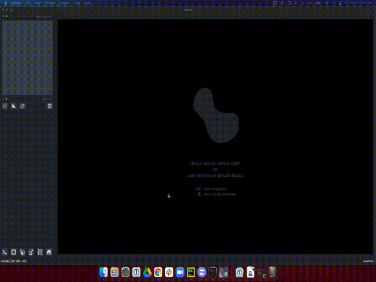
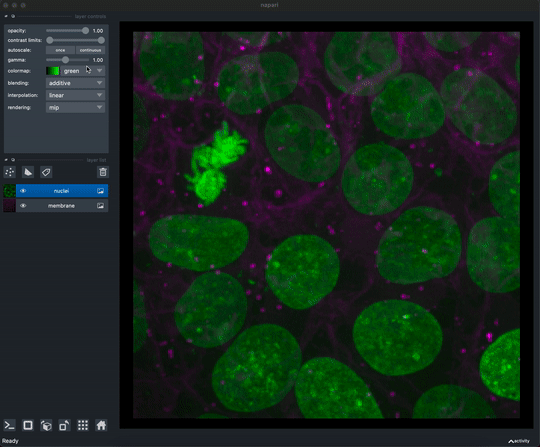

---
jupytext:
  formats: ipynb,md:myst
  text_representation:
    extension: .md
    format_name: myst
    format_version: 0.13
    jupytext_version: 1.11.5
kernelspec:
  display_name: Python 3 (ipykernel)
  language: python
  name: python3
---

# napari beginner

+++

## Summary

This tutorial uses napari 0.4.12. <br>

Showcase how to access napari functions from Python code and from GUI

+++

## Load image
napari natively supports tiff (and other formats supported by skimage.io.imread) as input image file format.<br>
Additional input file formats may be supported by plugins.<br>

<font color=blue> GUI has several file open options (drag and drop, File > Open File) <br></font>
<font color=red>link: supported file format and plugins</font>

```{code-cell} ipython3
:tags: [hide-cell]

import napari
viewer = napari.Viewer()
from skimage import data
#load multichannel image in one line, with additional options
viewer = napari.view_image(data.cells3d(), channel_axis=1, name=["membrane", "nuclei"])
viewer.dims.ndisplay = 3
```

````{tabbed} napari in code

```python
import napari
viewer = napari.Viewer()
from skimage import data
#load multichannel image in one line, with additional options
viewer = napari.view_image(data.cells3d(), channel_axis=1, name=["membrane", "nuclei"], colormap=["green", "magenta"])
viewer.dims.ndisplay = 3
```

````

````{tabbed} napari in GUI gif

````

+++

## Get image dimension

```{code-cell} ipython3
print("image dimension in (z,y,x):", viewer.layers['nuclei'].data.shape)
```

## Adjust image display

Both API and GUI have flexible image display control.<br>

For other display options, see [napari image layer API](https://napari.org/api/stable/napari.layers.Image.html).

+++

````{tabbed} napari in code

```python
#change nuclei color to magenta
viewer.layers['nuclei'].colormap = 'red'
viewer.layers['membrane'].colormap = 'green'
```

````

````{tabbed} napari in GUI gif

````

```{code-cell} ipython3
:tags: [hide-cell]

viewer.close()
```
